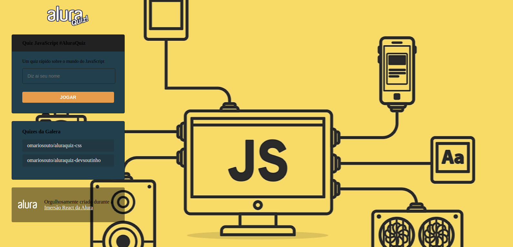

<div>
  <h1 align="center">ALURA QUIZ</h1>
  
  <div align="center">

  <a href="#sobre">Sobre</a> 
    |
  <a href="#tecnologias">Tecnólogias</a>
    |
  <a href="#dependencias">Dependências</a>
    |
  <a href="#Projeto">Pagina do projeto</a>

  </div>
</div>

<div >
<ul align="center">
  
  
</ul>

</div>


<div>
  <h3>Sobre.</h3>
  <h4 id="sobre" > <b>Projeto feito em Next.js.</b>
    Voltado para uma interação com o usuario, onde o gamer "QUIZ" pode testar seus conhecimentos voltados a linguagem de programação JAVASCRIPT, de forma divertida e dinamica. </h4>

  
</div>


<div id="tecnologias">
  <h3>Tecnológias.</h3>
  <ul>
    <li>
      <a href="https://nextjs.org/">NEXT.js.
      </a>
    </li>
    <li>
      <a href="https://pt-br.reactjs.org/docs/getting-started.html">REACT.
      </a>
    </li>
    <li>
      <a href="https://styled-components.com/">
        Styled-components.
      </a>
    </li>
    <li>
      <a href="https://developer.mozilla.org/pt-BR/docs/Web/JavaScript">JavaScript.
      </a>
    </li>
    <li>
      <a href="https://www.framer.com/motion/">
        Framer Motion.
      </a>
    </li>
    <li>
      <a href="https://nodejs.org/pt-br/docs/">
        NODE.JS.
      </a>
    </li>
    <li>
      <a href="https://classic.yarnpkg.com/en/docs/">
        YARN.
      </a>
    </li>
  </ul>
  
</div>

<div id="dependencias">
  <h3>Dependêcias.</h3>
    <p align="center">
      para utilizar da aplicação, será necessario fazer alguns procedimentos de instalção de pacotes
    </p>

```bash
# iniciar projeto Next.js
$ yarn create next-app
$ npx create-next-app

# Install Framer Motion
$ yarn add framer-motion
$ npm install framer-motion

#Styled-Components
$ yarn add styled-components
$ npm install styled-components
```

<h3>Baixar Projeto.</h3>  

```bash
# Clone this repository
$ git clone https://github.com/FullBarbosa/QuizJS.git QuizJS

# Install dependencies Yarn
$ yarn install

# Install dependencies NPM
$ npm install 
```
 </div>


<div id="Projeto">
  <h3>Projeto.</h3>
  <a href="https://quiz-js-ten.vercel.app/">
  
  </a>
</div>


<h3>Orgulhosamente feito durante a imersão React/NEXT.js</h3>